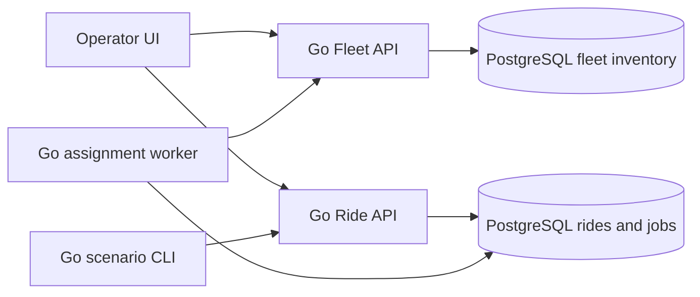
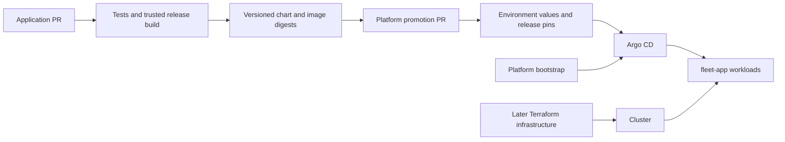

# Architecture and ownership

## Purpose

A small mock fleet application supplies real HTTP calls, durable queued work, observable failures and versioned releases for platform engineering experiments. Business behavior is synthetic and bounded; there is no vehicle control, real dispatch optimization or safety decision-making.

Operator story: during a Lansdowne surge, view synthetic availability, submit ride requests, observe backlog and assignments, interrupt a worker or slow an API, and verify recovery. The first outcome is a local application with a usable UI. AI and cloud access do not gate it.

## Ownership

| Concern | Application team: ottawa-fleet-app | Platform team: ottawa-fleet-platform |
|---|---|---|
| Workload | Go APIs, worker, scenario CLI and TypeScript UI | Workload acceptance and operating runbooks |
| Interfaces | API/job schemas, migrations, metrics/probes and service catalog descriptors | Runtime requirements, evidence queries and policies |
| Packaging | Dockerfiles, local Compose and application Helm releases | Environment values, immutable release references and promotion |
| Kubernetes | Namespace-portable workload templates | Cluster/bootstrap, namespace/RBAC policy and Argo CD |
| Scaling/traffic | Concurrent idempotent workers, stable metrics/configuration | KEDA scaling and Istio routing policies |
| Infrastructure | Development database configuration | Terraform infrastructure, state/lifecycle and cluster storage choices |
| Later integrations | Service metadata and APIs | Backstage runtime, observability and AI SRE tools |

The [release contract](application-release-contract.md) is the shared handoff. One resource has one managing owner. Platform references app artifacts rather than copying Helm templates. The app never installs cluster controllers.

## Planned local workload

Jobs and inventory may share one PostgreSQL instance for the lab; tables/migrations have explicit service ownership. The worker uses the documented job database contract. Other cross-service business calls use HTTP; the UI never accesses storage directly.

Use one Go module in the app's `services/`, with separate commands for APIs, worker and scenario runner. Share packages only where semantics are shared. UI code lives in `web/`; its minimal framework is selected in the bounded UI ticket. No service or framework scaffold exists yet.

PostgreSQL provides the initial durable queue to keep local dependencies small. Job leases, bounded retries and idempotent completion are essential: KEDA later needs multiple workers to behave correctly. A broker can be a separate experiment when a concrete need justifies it.

The contract ticket specifies endpoints, versions, state transitions, idempotency/conflict semantics, lease recovery, timestamps, pagination and bounds. A crash after fleet reservation but before job completion must recover using the same ride identity. Fixture/state behavior replaces the earlier full event-log/projector requirement; a telemetry platform is outside Phase 1.

## Deployment progression

1. **Local:** app-owned Compose, synthetic scenarios, logs/metrics and explicit reset. No Kubernetes dependency.
2. **Kubernetes/GitOps:** choose a disposable local cluster after measuring laptop capacity. Application workloads run in `fleet-app`; Argo CD and monitoring use controller namespaces. Platform owns namespaces/access policy. GCP is optional after a separate resource/eligibility review.
3. **Scaling/traffic:** KEDA scales workers from durable backlog; Istio experiments exercise the worker-to-fleet call path. Measure each independently with caps and rollback.
4. **Developer experience/AI:** Backstage catalogs an operating platform. AI begins with read-only evidence; later actions have separate policy/approval/executor boundaries. Model hosting is a separate future project and endpoint.

No controller versions, cluster sizes, GPU availability or cloud cost estimates are established here. Implementation tickets verify the actual versions and capabilities used.

## Delivery ownership

Small services already support GitOps experiments: promotion, drift correction, rollback and configuration review. Automatic progressive delivery is a separate extension. A healthy Argo sync alone does not prove application health.

Terraform owns infrastructure; bootstrap establishes controllers; Argo owns declared in-cluster resources. When KEDA owns replicas, chart and reconciliation policy must avoid resetting them. Application packaging must support that handoff.

Namespaces communicate ownership but do not provide complete isolation. Deployment tickets define RBAC, network access, credentials and workload privileges before exposure. Public PR jobs receive no cloud, cluster or inference credentials.

## Evidence and decisions

Phase 1 validates requests, idempotent submission, durable jobs, two-worker concurrency, crash recovery, bounded faults and honest stale/unavailable UI states. Record workload and resources before setting performance targets.

Still to decide in bounded tickets: API/job schemas, UI framework, tool versions, migrations, resource baseline, local cluster distribution and chart/database deployment options. Cloud sizing, Istio mode and KEDA scaler details are later gated decisions.

See [ADR 0002](adr/0002-two-repository-local-first-platform.md) and the [roadmap](roadmap.md). This is a target architecture, not deployment evidence.
