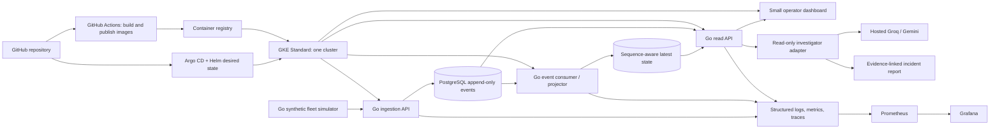

# Platform architecture

## Purpose and boundary

This is a portfolio demo of an Ottawa electric robotaxi fleet platform using synthetic telemetry. It models operational visibility and dispatchable capacity; it does not control vehicles, route them, or make real-world driving or safety decisions. Vehicle events are untrusted input. The dashboard and read-only AI investigator support human analysis only.

The demo story is a Lansdowne event demand surge coinciding with stale telemetry after an ingestion or consumer outage. Operators should be able to distinguish genuinely unavailable capacity from vehicles whose state is simply no longer fresh. All locations, trips, vehicles, and measurements are synthetic.

## Logical view

This is a target design, not a report of a running deployment. No cloud resources or working application are claimed. Initial sizing and component choices are provisional and should be revisited with measured traffic and resource use.

## Data and service boundaries

- **Simulator:** Go process emits deterministic, synthetic vehicle and demand events. It can replay scenarios and inject delays, duplicate delivery, gaps, and restarts.
- **Ingestion:** Go HTTP service validates schema and bounds, authenticates service-to-service traffic when deployed, and commits accepted events durably. It does not infer safety or command a vehicle.
- **Event store:** PostgreSQL retains accepted events as append-only records with source identity, vehicle identity, sequence, event time, receive time, and payload. Corrections are new events; historical records are not silently rewritten.
- **Latest state:** A projection records the newest accepted sequence per vehicle and its freshness. A lower or repeated sequence cannot replace newer state; duplicate event identities are idempotent. Gaps are observable and do not imply that missing events never occurred. Projection updates and event persistence need recoverable transaction boundaries.
- **Read API and dashboard:** Go read API serves fleet capacity, freshness, battery, maintenance, and incident indicators. The small dashboard framework remains undecided. “Dispatchable” is a demo policy label based on configured operational criteria; it is not a driving-safety assertion or automatic dispatch command.
- **Investigator:** A read-only adapter can call hosted Groq or Gemini models initially. Its tools expose bounded, parameterized queries and a restricted time range/result count. It receives no credentials for writes, cannot execute SQL supplied by a model, and cannot change fleet or platform state. Reports link each finding to event IDs, timestamps, and metric/query evidence; uncertainty and missing data are explicit. Minimize data sent to hosted providers and keep the synthetic-only boundary.
- **Operations:** Prometheus and Grafana provide compact service, ingest lag, consumer lag, database, freshness, and scenario views. OpenTelemetry instrumentation and structured logs provide correlated evidence. Backstage catalogs services, owners, dependencies, and runbooks. Argo CD reconciles Helm releases from Git; GitHub Actions builds and publishes prebuilt images with bounded permissions and workflow timeouts.

## Failure and recovery scenario

1. The simulator raises synthetic demand around Lansdowne and continues incrementing per-vehicle sequence numbers.
2. Ingestion or the event consumer becomes unavailable. Ingestion failures are visible to the simulator; events are retried with stable identities. If the consumer is down after durable writes, events accumulate and consumer lag grows. If ingestion is down, the demo simulator retains a bounded replay queue; overflow is surfaced as a known data-loss interval rather than hidden.
3. The dashboard shows demand alongside last-seen time and freshness. Capacity based on stale records is marked unknown/stale and excluded from confidently available capacity. Battery and maintenance values retain their observed timestamp. The incident view shows the outage interval and any sequence gaps.
4. Restore the failed service. Replay/reconsume stored events idempotently, reject stale sequence overwrites, and track lag until caught up. For events lost before durable acceptance, preserve the gap marker; do not fabricate state.
5. Confirm fresh sequence progress, falling lag, healthy probes, and consistent event-to-projection counts. The investigator may summarize evidence and cite records, but a human reviews conclusions and any operational action.

## Deployment and delivery

The intended first cloud shape is one GKE Standard cluster, with a small number of separately deployable Go services, dashboard, PostgreSQL, and compact monitoring. Initial database hosting, ingress, identity, secret storage, retention, availability targets, and exact node sizes are undecided. Keep resource requests and limits explicit and start with conservative provisional sizing; validate against observed simulator load before making capacity claims.

GitHub Actions should build and publish immutable image tags. Argo CD and Helm define the deployed state; pull requests review changes before reconciliation. Separate application configuration from secrets, keep cloud credentials off untrusted pull-request runners, use least privilege, and define workflow concurrency and timeouts. Backstage entries should link each component to ownership, dashboards, and actionable runbooks. Terraform is deferred until the application shape and cloud feasibility are clearer.

## Testing and evidence

- Unit tests cover schema validation, event identity, sequence ordering, idempotency, freshness, capacity labels, and safe bounds on investigator tools.
- Integration tests exercise PostgreSQL transactions, duplicate/reordered events, consumer restart and replay, and event-to-projection consistency.
- Scenario tests inject the Lansdowne demand surge, ingestion outage, consumer outage, queue overflow, recovery, and persistent sequence gaps; assertions cover visible staleness and evidence references.
- API/UI checks verify stale or missing data is clearly labeled and never represented as a current vehicle fact. Investigator checks verify read-only access, bounded query results, citations, and behavior when evidence is incomplete.
- CI builds and runs tests without cloud credentials. Image scanning and deployment checks can be added with explicit scope. Any future cloud exercise needs a documented quota/feasibility and cost/teardown review before provisioning.

## Weekend scope and later work

**Weekend demo:** implement simulator, ingestion, PostgreSQL event log and projection, read API, one focused dashboard, outage/replay scenario, structured logs and a few Prometheus/Grafana signals. Use local containers first. Add a bounded investigator adapter only after the underlying evidence queries are stable. Keep Kubernetes manifests and Argo CD configuration reviewable; do not imply deployment until verified.

**Weekend cloud target:** deploy the working slice to GKE after quota, access, cost, and teardown feasibility are established. Add Backstage catalog/runbooks once the measured core footprint leaves headroom. This is a target, not a promise that every integration will be complete by the weekend deadline.

**Later:** harden identity, secrets, backups, retention, and availability; add Backstage polish and broader observability; measure and tune sizing; evaluate provider privacy, latency, and cost. Experiment with an open-source CPU model adapter behind the same read-only interface. GPU scheduling is a gated roadmap item: device plugin, dedicated node pool, taints/tolerations, and explicit GPU resource limits require supported quota and feasible billing. The unupgraded GCP Free Trial does not permit GPU provisioning; no billing upgrade or GPU deployment is assumed.

## Open decisions

Dashboard framework; database hosting and backup model; event retention and privacy policy; service identity and secret management; authentication/authorization for operators; precise stale threshold and demo dispatchability policy; simulator replay/overflow limits; hosted model data handling and prompt-injection defenses; and cloud quota, cost, and teardown plan. Document decisions when evidence from the working demo exists.
