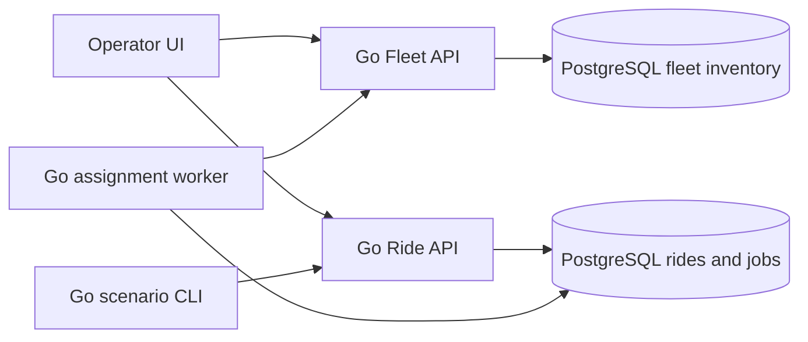
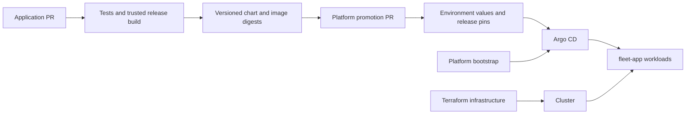

# Architecture and ownership

## Purpose

A small mock fleet application supplies real HTTP calls, durable queued work, observable failures and versioned releases for platform engineering experiments. Business behavior is synthetic and bounded; there is no vehicle control, real dispatch optimization or safety decision-making.

Operator story: during a Lansdowne surge, view synthetic availability, submit ride requests, observe backlog and assignments, interrupt a worker or slow an API, and verify recovery. The first outcome is a local application with a usable UI. AI and cloud access do not gate it.

## Ownership

| Concern | Application team: ottawa-fleet-app | Platform team: ottawa-fleet-platform |
|---|---|---|
| Workload | Go APIs, worker, scenario CLI and TypeScript UI | Workload acceptance and operating runbooks |
| Interfaces | API/job schemas, migrations, metrics/probes and service catalog descriptors | Runtime requirements, evidence queries and policies |
| Packaging | Dockerfiles, local Compose and application Helm releases | Environment values, immutable release references and promotion |
| Kubernetes | Namespace-portable workload templates | Cluster/bootstrap, namespace/RBAC policy and Argo CD |
| Scaling/traffic | Concurrent idempotent workers, stable metrics/configuration | KEDA scaling and Istio routing policies |
| Infrastructure | Development database configuration | Terraform infrastructure, state/lifecycle and cluster storage choices |
| Later integrations | Service metadata and APIs | Backstage runtime, observability and AI SRE tools |

The [release contract](application-release-contract.md) is the shared handoff. One resource has one managing owner. Platform references app artifacts rather than copying Helm templates. The app never installs cluster controllers.

## Application workload

Jobs and inventory may share one PostgreSQL instance for the lab; tables/migrations have explicit service ownership. The worker uses the documented job database contract. Other cross-service business calls use HTTP; the UI never accesses storage directly.

The app uses one Go module in `services/`, with separate commands for APIs,
worker and scenario runner, and a TypeScript operator UI in `web/`. These
components, migrations, contracts and Docker/Compose packaging are merged.
See the [application architecture](https://github.com/ANISHG-26/ottawa-fleet-app/blob/main/docs/architecture.md)
for the implemented interfaces and [current delivery status](project-management.md#current-delivery-and-review)
for the remaining acceptance gates.

PostgreSQL provides the initial durable queue to keep local dependencies small. Job leases, bounded retries and idempotent completion are essential: KEDA later needs multiple workers to behave correctly. A broker can be a separate experiment when a concrete need justifies it.

The [v1 application contracts](https://github.com/ANISHG-26/ottawa-fleet-app/tree/main/contracts)
specify endpoints, state transitions, idempotency/conflicts, lease recovery,
timestamps, pagination and bounds. A crash after fleet reservation but before
job completion must recover using the same ride identity. Fixture/state behavior
replaces the earlier event-log/projector requirement. Optional app telemetry
exports to the platform-owned LGTM stack; telemetry does not gate local business
behavior.

## Deployment progression

1. **Local:** app-owned Compose, synthetic scenarios, logs/metrics and explicit reset. No Kubernetes dependency.
2. **Kubernetes/GitOps:** choose a disposable local cluster after measuring laptop capacity. Application workloads run in `fleet-app`; Argo CD and monitoring use controller namespaces. Platform owns namespaces/access policy. GCP is optional after a separate resource/eligibility review.
3. **Scaling/traffic:** KEDA scales workers from durable backlog; Istio experiments exercise the worker-to-fleet call path. Measure each independently with caps and rollback.
4. **Developer experience/AI:** Backstage catalogs an operating platform. AI begins with read-only evidence; later actions have separate policy/approval/executor boundaries. Model hosting is a separate future project and endpoint.

The selected kind/Argo configuration is documented in [bootstrap](../bootstrap/README.md).
The manual GCP shape and initial resource hypothesis are documented in
[lab sizing](lab-sizing-and-cost.md). They do not establish accepted load
measurements, repeatable CI deployment or GPU eligibility. KEDA and Istio
versions/policies remain decisions for their bounded experiments.

## Delivery ownership

Small services already support GitOps experiments: promotion, drift correction, rollback and configuration review. Automatic progressive delivery is a separate extension. A healthy Argo sync alone does not prove application health.

Terraform owns infrastructure; bootstrap establishes controllers; Argo owns declared in-cluster resources. When KEDA owns replicas, chart and reconciliation policy must avoid resetting them. Application packaging must support that handoff.

Namespaces communicate ownership but do not provide complete isolation. Deployment tickets define RBAC, network access, credentials and workload privileges before exposure. Public PR jobs receive no cloud, cluster or inference credentials.

## Evidence and decisions

Phase 1 validates requests, idempotent submission, durable jobs, two-worker concurrency, crash recovery, bounded faults and honest stale/unavailable UI states. Record workload and resources before setting performance targets.

Contracts, migrations, application packaging, kind bootstrap, bounded GKE/private
SQL configuration and the CI expiry design have implementations. Remaining
evidence includes the local resource baseline, live CI provisioning/expiry,
repeatable promotion/drift/rollback and teardown. Istio mode, KEDA scaler policy,
Backstage and AI remain later bounded decisions.

See [ADR 0002](adr/0002-two-repository-local-first-platform.md), the [roadmap](roadmap.md)
and the [tooling map](tooling-map.md). Architecture describes ownership and
interfaces; acceptance requires the evidence attached to each outcome.
